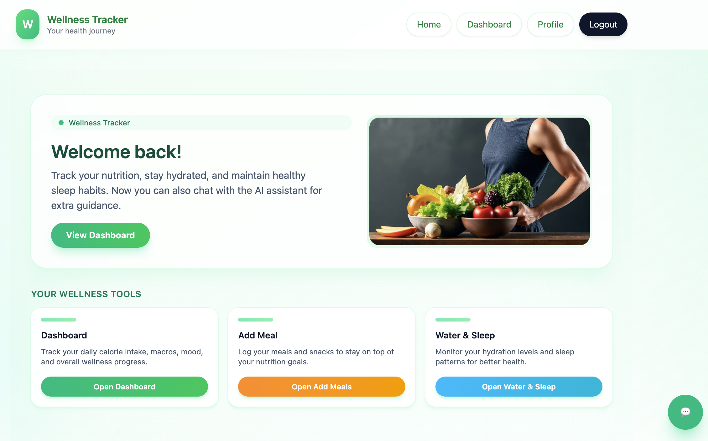

# 🌿 WellBalance — Wellness & Nutrition Tracker

**WellBalance** is a modern web application for tracking nutrition, calories, macronutrients  and overall well-being.  
The project is built with **Next.js**, **Supabase**, and an integrated **AI chat assistant (Gemini)**.

---

## ✨ Key Features

## 🔐 Authentication (Supabase)
- Sign up & login with email and password  
- User profiles stored in `auth.users` + `profiles`  

---

## 📊 Dashboard

The dashboard includes several interactive charts and summaries:

### **1. Today’s Progress**
- Daily calorie consumption  
- Comparison with personal calorie goals  
- Navigation between days  

### **2. Macronutrients Balance**
- Ring chart showing total macros  
- Progress bars for: **Protein**, **Carbs**, **Fat**  
- Based on user-defined daily goals  

### **3. Weekly Calorie Trend**
- Line chart showing the last 7 days  
- Tooltips with exact calorie values  
- Highlights the selected day  

---

## 🍽️ Meals & Foods

### Add Meal – categorized food items  
Food items are organized into categories:

- **Protein**  
- **Carbs**  
- **Fat**  
- **Vegetables**  
- **Fruits**  
- **Custom Foods** (user-created)

Users can:
- Select foods  
- Adjust quantities  
- **Create custom food cards**, saved permanently in their database  

---

## 🎯 User Goals (Profile)

On the **Profile** page, users can define personal daily targets:

- Calories  
- Protein  
- Carbs  
- Fat  

These values influence:
- Dashboard visualizations  
- Daily progress calculations  
- AI assistant responses  

---

## 🤖 AI Chat Assistant (Gemini)

The built-in AI assistant can:

- Answer questions about nutrition, habits, and wellness  
- Switch conversation styles (neutral, casual, formal, pirate)  
- Save chat history locally  

### 🔍 Access to real user data  
The assistant fetches live data from Supabase, including:

- daily consumed calories  
- protein, carb, and fat totals  
- personal goal values  

Example questions:
- “How many calories have I eaten today?”  
- “How much protein do I still need?”  
- “Compare my past 7 days.”  

---

## 💧 Water & Sleep

The **Water & Sleep** page exists but is **reserved for future development**.

Planned features:
- Daily water intake tracking  
- Sleep duration & quality  
- Visual charts & trends  

---

## 🎨 UI Design 

Designed in **Figma Make**, inspired by wellness apps:

- soft green palette  
- minimal light interface   
- rounded components for a calming aesthetic  

---

## 🧩 Tech Stack

### Frontend
- Next.js  
- React Server & Client Components  
- Tailwind CSS  
- Storybook  
- Recharts  

### Backend
- Supabase (Auth, PostgreSQL, RLS Policies)  
- Auto-generated TypeScript types  

### 🤖 AI
- Google Gemini (in-app assistant)  
- GitHub Copilot (development assistance)  
- OpenAI GPT (additional help during development)  

---

## 🗄️ Database Schema 

Main tables:
- `profiles`  
- `daily_logs`  
- `meals`  
- `meal_items`  
- `foods`  
- `user_targets`  
- `water_intake`  
- `sleep_logs`  

---

## ✍️ Author

**Nataly Bova**  
Design, development, and AI integration  
GitHub: https://github.com/NatalyBova111
